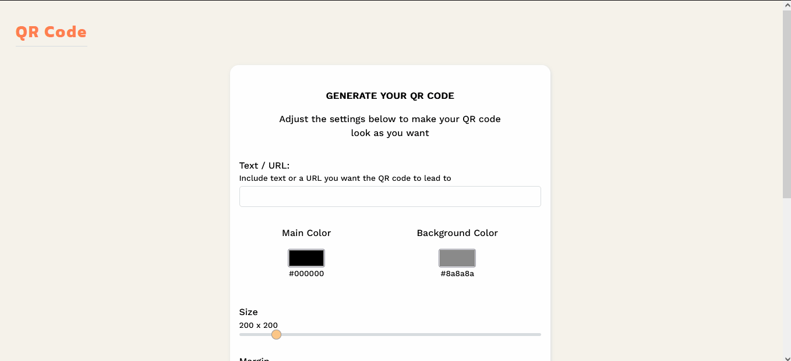

# QR Code Generator API

QR Code Generator - a simple Web App that generates a QR Code depending on user’s input.

## Tech Stack

```
Core:
- HTML
- CSS
- JS

Communication tool:
- fetch
- img src

```
## Preview

